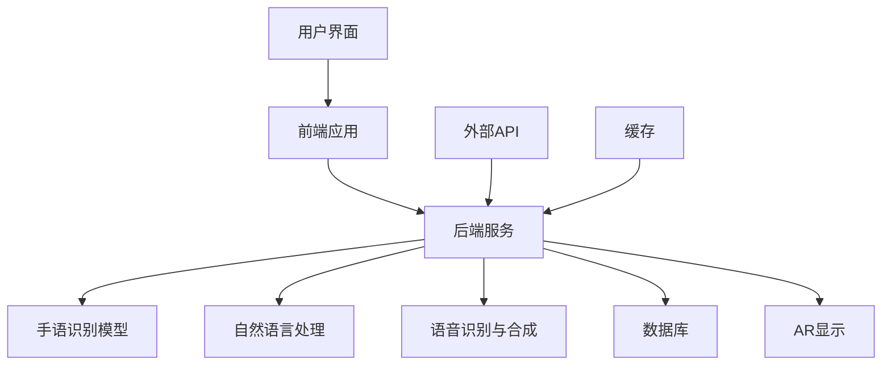
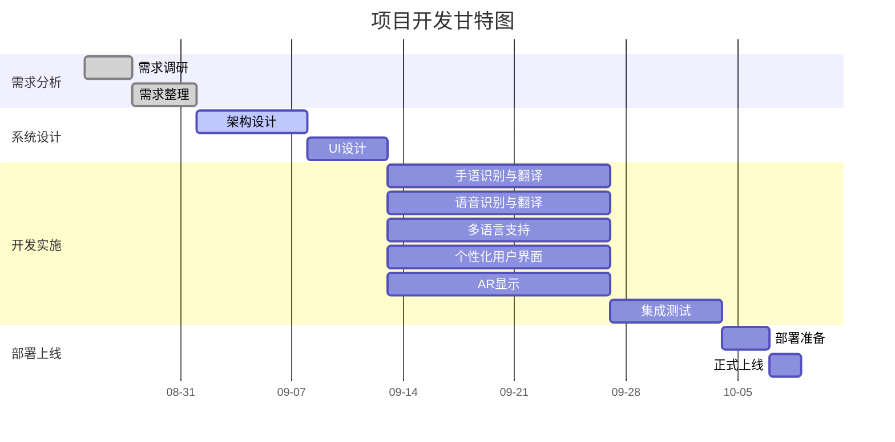

<div class="plan-header">

# 🚀 AI生成的开发计划

<div class="meta-info">

**⏰ 生成时间：** 2025-08-21 10:37:38  
**🤖 AI模型：** Qwen2.5-72B-Instruct  
**💡 基于用户创意智能分析生成**  
**🔗 Agent应用MCP服务增强**

</div>

</div>

---

# HandVoice 开发计划

## 产品概述

**项目名称**：HandVoice

**项目目标**：开发一款增强现实（AR）应用程序，能够实时将手语翻译成语音和文字，同时也能将语音和文字翻译成手语，以手势形式展示。HandVoice的核心功能包括实时手语识别与翻译、多语言支持、个性化用户界面和高精度的手势识别技术。该应用旨在帮助聋哑人和听力正常人之间的沟通更加顺畅，减少误解，提高社会融合度。目标用户包括聋哑人、手语学习者、教师、医疗工作者等。使用场景广泛，如教育、医疗、公共服务、家庭交流等。

**关键技术**：
- 深度学习的手语识别模型
- 自然语言处理技术
- AR显示技术

## 技术方案

### 技术栈

| 技术栈 | 描述 |
|--------|------|
| **前端** | React Native（跨平台开发） |
| **后端** | Node.js + Express |
| **数据库** | MongoDB |
| **机器学习** | TensorFlow（手语识别模型） |
| **自然语言处理** | spaCy |
| **AR显示** | ARKit（iOS） / ARCore（Android） |
| **语音识别与合成** | Google Cloud Speech-to-Text / Text-to-Speech |
| **云服务** | AWS |

### 架构图



### 功能模块


**1. 手语识别与翻译**


**2. 语音识别与翻译**


**3. 多语言支持**


**4. 个性化用户界面**


**5. AR显示**


### 技术栈对比

| 技术栈 | 优点 | 缺点 |
|--------|------|------|
| **前端** | React Native | 跨平台开发，代码复用率高 | 学习曲线较陡，某些原生功能需要额外开发 |
| **后端** | Node.js + Express | 轻量级，开发速度快 | 可能存在性能瓶颈，需要优化 |
| **数据库** | MongoDB | 灵活，支持动态数据结构 | 查询性能不如关系型数据库 |
| **机器学习** | TensorFlow | 生态丰富，社区支持好 | 需要强大的计算资源 |
| **自然语言处理** | spaCy | 功能强大，易于使用 | 模型较大，部署成本高 |
| **AR显示** | ARKit / ARCore | 平台原生支持，性能好 | 需要针对不同平台进行适配 |
| **语音识别与合成** | Google Cloud Speech-to-Text / Text-to-Speech | 高精度，支持多语言 | 需要网络连接，成本较高 |
| **云服务** | AWS | 稳定，可扩展性强 | 成本较高，需要专业运维 |

## 开发计划

### 项目时间表



### 项目里程碑

| 里程碑 | 日期 | 描述 |
|--------|------|------|
| 需求调研完成 | 2025-08-28 | 完成用户需求调研和整理 |
| 系统设计完成 | 2025-09-11 | 完成系统架构和UI设计 |
| 手语识别与翻译开发完成 | 2025-09-25 | 完成手语识别与翻译功能开发 |
| 语音识别与翻译开发完成 | 2025-09-25 | 完成语音识别与翻译功能开发 |
| 多语言支持开发完成 | 2025-09-25 | 完成多语言支持功能开发 |
| 个性化用户界面开发完成 | 2025-09-25 | 完成个性化用户界面功能开发 |
| AR显示开发完成 | 2025-09-25 | 完成AR显示功能开发 |
| 集成测试完成 | 2025-10-02 | 完成所有功能的集成测试 |
| 部署准备完成 | 2025-10-05 | 完成部署前的准备工作 |
| 正式上线 | 2025-10-07 | 项目正式上线 |

### 部署方案


**1. 前端应用**：

   - 使用React Native打包生成iOS和Android应用
   - 发布到App Store和Google Play


**2. 后端服务**：

   - 使用Node.js + Express部署到AWS EC2
   - 配置负载均衡和自动扩展


**3. 数据库**：

   - 使用MongoDB Atlas作为云端数据库
   - 配置备份和恢复策略


**4. 机器学习模型**：

   - 使用TensorFlow Serving部署手语识别模型
   - 配置模型版本管理


**5. AR显示**：

   - 使用ARKit和ARCore分别在iOS和Android上实现AR显示
   - 确保AR显示的稳定性和性能

### 推广策略


**1. 市场调研**：

   - 了解目标用户的需求和使用场景
   - 收集用户反馈，不断优化产品


**2. 合作伙伴**：

   - 与聋哑人组织、手语学习机构、医院等建立合作关系
   - 通过合作伙伴进行产品推广和用户培训


**3. 媒体宣传**：

   - 制作产品宣传视频，发布到社交媒体和视频平台
   - 参加行业展会和技术论坛，展示产品功能和优势


**4. 用户培训**：

   - 提供详细的用户手册和在线教程
   - 举办线上和线下培训活动，帮助用户快速上手


**5. 用户体验**：

   - 设立用户体验中心，收集用户反馈
   - 不断优化用户体验，提升用户满意度

#

---


<div class="prompts-highlight">

# 🤖 AI编程助手提示词

> 💡 **使用说明**：以下提示词基于您的项目需求定制生成，可直接复制到 GitHub Copilot、ChatGPT、Claude 等AI编程工具中使用


### 手语识别与翻译开发提示词


```
请为HandVoice开发手语识别与翻译功能。

项目背景：
HandVoice是一款增强现实（AR）应用程序，旨在帮助聋哑人和听力正常人之间的沟通更加顺畅。手语识别与翻译功能是核心功能之一，需要能够实时将手语翻译成语音和文字。

功能要求：
1. 实现实时手语识别，能够准确识别手语手势
2. 将手语手势翻译成语音和文字
3. 支持多种手语（如美国手语、英国手语等）
4. 优化识别速度和准确率

技术约束：
- 使用TensorFlow进行手语识别模型的训练和部署
- 确保模型在移动端的性能和稳定性
- 集成到React Native前端应用中

输出要求：
- 完整可运行代码
- 详细注释说明
- 错误处理机制
- 测试用例
```


### 语音识别与翻译开发提示词


```
请为HandVoice开发语音识别与翻译功能。

项目背景：
HandVoice是一款增强现实（AR）应用程序，旨在帮助聋哑人和听力正常人之间的沟通更加顺畅。语音识别与翻译功能是核心功能之一，需要能够实时将语音翻译成手语和文字。

功能要求：
1. 实现实时语音识别，能够准确识别语音内容
2. 将语音内容翻译成手语和文字
3. 支持多种语言（如英语、中文、西班牙语等）
4. 优化识别速度和准确率

技术约束：
- 使用Google Cloud Speech-to-Text进行语音识别
- 使用Google Cloud Text-to-Speech进行语音合成
- 确保在移动端的性能和稳定性
- 集成到React Native前端应用中

输出要求：
- 完整可运行代码
- 详细注释说明
- 错误处理机制
- 测试用例
```


### 多语言支持开发提示词


```
请为HandVoice开发多语言支持功能。

项目背景：
HandVoice是一款增强现实（AR）应用程序，旨在帮助聋哑人和听力正常人之间的沟通更加顺畅。多语言支持功能是重要功能之一，需要能够支持多种语言的输入和输出。

功能要求：
1. 支持多种语言的输入（如英语、中文、西班牙语等）
2. 支持多种语言的输出（文字和语音）
3. 提供语言切换功能，用户可以自由选择输入和输出语言
4. 优化多语言处理的性能和准确率

技术约束：
- 使用Google Cloud Translation API进行多语言翻译
- 确保在移动端的性能和稳定性
- 集成到React Native前端应用中

输出要求：
- 完整可运行代码
- 详细注释说明
- 错误处理机制
- 测试用例
```


### 个性化用户界面开发提示词


```
请为HandVoice开发个性化用户界面功能。

项目背景：
HandVoice是一款增强现实（AR）应用程序，旨在帮助聋哑人和听力正常人之间的沟通更加顺畅。个性化用户界面功能是提升用户体验的重要部分，需要能够根据用户的偏好和需求进行个性化配置。

功能要求：
1. 提供多种主题和样式供用户选择
2. 支持用户自定义界面布局
3. 提供个性化设置选项，如字体大小、颜色等
4. 优化用户界面的可用性和美观性

技术约束：
- 使用React Native进行前端开发
- 确保界面的响应速度和稳定性
- 集成到React Native前端应用中

输出要求：
- 完整可运行代码
- 详细注释说明
- 错误处理机制
- 测试用例
```


### AR显示开发提示词


```
请为HandVoice开发AR显示功能。

项目背景：
HandVoice是一款增强现实（AR）应用程序，旨在帮助聋哑人和听力正常人之间的沟通更加顺畅。AR显示功能是核心功能之一，需要能够将手语手势以AR形式展示。

功能要求：
1. 实现实时AR显示，能够将手语手势以AR形式展示
2. 支持多种手势的AR显示
3. 优化AR显示的性能和稳定性
4. 确保在不同设备上的兼容性

技术约束：
- 使用ARKit进行iOS端的AR显示
- 使用ARCore进行Android端的AR显示
- 确保在移动端的性能和稳定性
- 集成到React Native前端应用中

输出要求：
- 完整可运行代码
- 详细注释说明
- 错误处理机制
- 测试用例
```


以上是HandVoice项目的详细开发计划和AI编程助手提示词。希望这些内容能够帮助项目顺利进行。

</div>
