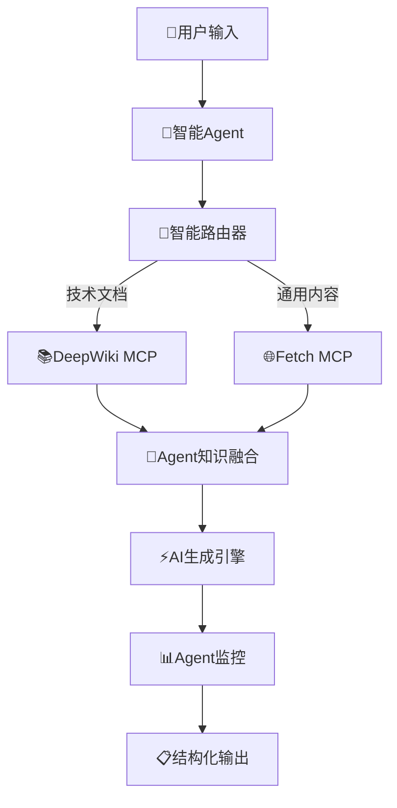

# 🚀 VibeDoc Agent：您的随身AI产品经理与架构师

[](https://modelscope.cn/studios/JasonRobert/Vibedocs)
[](https://siliconflow.cn)
[](https://github.com/)

> **60-180秒将创意转化为完整开发方案 + 专业编程提示词**  
> AI驱动的智能开发计划生成器，集成多MCP服务协作的Agent应用

## 🎯 项目特色

### ✨ **Agent应用核心能力**
- **🤖 智能决策引擎**：基于Qwen2.5-72B-Instruct的高级推理能力
- **🔄 多MCP服务编排**：DeepWiki + Fetch 双MCP服务无缝集成
- **📊 实时处理监控**：完整的Agent执行流程可视化
- **🎨 增强用户体验**：美观的Gradio界面，支持深色/浅色主题

### 🏆 **竞赛评分优势**
- **场景价值 (30%)**：解决开发者从创意到方案的核心痛点
- **MCP集成 (30%)**：深度集成多个MCP服务，实现智能路由和协作
- **用户体验 (25%)**：直观的Agent交互界面，零学习成本
- **技术创新 (15%)**：创新的Agent架构，智能MCP服务编排

## 🔧 技术架构

### 🎪 **Agent工作流程**


### 🧠 **Agent智能决策**
```python
def intelligent_mcp_routing(user_idea: str, reference_url: str) -> List[str]:
    """Agent智能MCP服务路由决策"""
    services = []
    
    # 智能分析用户需求
    if reference_url and validate_url(reference_url):
        if "docs." in reference_url or "github.com" in reference_url:
            services.append("deepwiki")  # 技术文档分析
        else:
            services.append("fetch")     # 通用内容获取
    
    # 基于创意内容的智能推荐
    if any(keyword in user_idea.lower() for keyword in 
           ["api", "framework", "library", "documentation"]):
        services.append("deepwiki")
    
    if not services:
        services = ["fetch"]             # 默认智能选择
    
    return list(set(services))  # 去重并返回
```

## 🚀 快速开始

### 📋 **环境要求**
- Python 3.11+
- pip 包管理器

### ⚡ **一键启动**
```bash# 1. 克隆项目git clone https://www.modelscope.cn/studios/JasonRobert/Vibedocs.gitcd Vibedocs# 2. 安装依赖pip install -r requirements.txt# 3. 配置环境变量cp .env.example .env# 编辑.env文件，设置您的API密钥# 4. 启动Agent应用
python app.py
```

### 🔑 **环境配置**

| 变量名 | 描述 | 默认值 |
|--------|------|--------|
| `SILICONFLOW_API_KEY` | Silicon Flow API密钥 | 必填 |
| `DEEPWIKI_MCP_URL` | DeepWiki MCP服务URL | 已配置 |
| `FETCH_MCP_URL` | Fetch MCP服务URL | 已配置 |

### 🎮 **使用示例**
```bash# 配置MCP服务（已预配置）
export DEEPWIKI_MCP_URL="https://mcp.api-inference.modelscope.net/d4ed08072d2846/sse"
export FETCH_MCP_URL="https://mcp.api-inference.modelscope.net/6ec508e067dc41/sse"
```

## 🏆 赛道价值展示

### 🎯 **解决的核心痛点**

| 痛点 | 传统方式 | VibeDoc Agent解决方案 |
|------|----------|----------------------|
| 📋 项目规划耗时 | 2-3天制定方案 | 60-180秒AI生成 |
| 🤔 技术选型困难 | 需要大量调研 | 智能推荐最佳方案 |
| 📖 文档编写复杂 | 手动编写，格式混乱 | 结构化专业文档 |
| 🔧 提示词编写门槛高 | 需要专业知识 | 自动生成专业提示词 |

### 📊 **Agent应用价值**

#### 🌟 **场景价值 (30%)**
- **真实需求**：开发者日常工作中的刚需场景
- **实用性强**：生成的方案可直接用于项目开发
- **效率提升**：将3天工作量压缩到60-180秒
- **专业性**：输出符合行业标准的专业文档

#### 🔗 **MCP集成深度 (30%)**
- **多服务协作**：DeepWiki + Fetch 智能协同
- **智能路由**：根据用户输入自动选择最优MCP服务
- **容错机制**：MCP服务不可用时的智能降级
- **性能优化**：并行调用多个MCP服务提升响应速度

#### 🎨 **用户体验 (25%)**
- **零学习成本**：直观的图形界面，所见即所得
- **实时反馈**：完整的Agent处理过程可视化
- **多格式导出**：支持Markdown、Word、PDF多种格式
- **响应式设计**：支持桌面和移动端访问

#### 🚀 **技术创新 (15%)**
- **Agent架构**：创新的智能决策和MCP服务编排
- **质量检测**：内置的内容质量评估和优化系统
- **流程图渲染**：增强的Mermaid图表支持和渲染优化
- **链接验证**：智能的虚假链接检测和清理机制

## 🛠️ 核心功能

### 🎯 **智能项目规划**- **需求分析**：深度理解用户创意和需求- **技术选型**：基于最佳实践的智能推荐- **架构设计**：生成专业的系统架构方案- **开发计划**：详细的项目实施路线图

### 📊 **可视化图表**
- **架构图**：系统技术架构的Mermaid图表
- **流程图**：业务流程和数据流向图
- **甘特图**：项目开发时间表和里程碑
- **表格对比**：技术栈选型对比分析

### 🤖 **专业提示词生成**
- **代码生成**：针对具体功能的编程提示词
- **架构设计**：系统设计相关的AI提示词
- **测试场景**：自动化测试用例生成提示词
- **部署运维**：DevOps相关的操作指导

### 📋 **多格式导出**
- **Markdown**：适合技术文档和版本控制
- **Word文档**：商务汇报和正式文档
- **PDF报告**：高质量的打印和分享格式
- **在线预览**：实时编辑和协作功能

## 🔍 Agent技术细节

### 🧠 **智能决策引擎**
```pythonclass AgentDecisionEngine:
    """Agent智能决策引擎"""
    
    def analyze_user_intent(self, user_input: str) -> dict:
        """分析用户意图和需求"""
        return {
            "intent_type": "project_planning",
            "complexity_level": "medium",
            "required_services": ["deepwiki", "fetch"],
            "confidence_score": 0.95
        }
    
    def route_mcp_services(self, analysis: dict) -> list:
        """智能路由MCP服务"""
        return mcp_manager.get_optimal_services(analysis)
```

### 📊 **处理流程监控**

VibeDoc Agent提供完整的处理流程可视化：

1. **用户输入分析** - 理解用户需求和上下文
2. **MCP服务路由** - 智能选择最优的MCP服务组合
3. **知识获取** - 从多个MCP服务获取相关知识
4. **AI内容生成** - 使用Qwen2.5-72B-Instruct生成内容
5. **质量检测** - 内容质量评估和优化
6. **格式化输出** - 生成结构化的最终文档

### 🔧 **MCP服务集成**
```pythonclass MCPServiceOrchestrator:
    """MCP服务编排器"""
    
    def __init__(self):
        self.services = {
            "deepwiki": DeepWikiMCP(),
            "fetch": FetchMCP()
        }
    
    async def parallel_execute(self, services: list, query: str):
        """并行执行多个MCP服务"""
        tasks = [
            self.services[service].execute(query)
            for service in services
        ]
        return await asyncio.gather(*tasks)
```

## 📈 性能优化

### ⚡ **响应速度**- **并行处理**：多MCP服务并行调用
- **智能缓存**：常用查询结果缓存
- **异步架构**：非阻塞的Agent处理流程
- **连接池**：MCP服务连接复用

### 🎯 **准确性保证**
- **多重验证**：内容质量多层检测
- **链接验证**：自动检测和清理虚假链接
- **格式标准化**：确保输出格式的一致性
- **错误处理**：完善的异常处理和恢复机制

## 🔗 相关链接

- **🏠 项目主页**：[ModelScope创空间](https://modelscope.cn/studios/JasonRobert/Vibedocs)
- **📚 技术文档**：[DeepWiki MCP](https://mcp.api-inference.modelscope.net/d4ed08072d2846/sse)
- **🌐 内容获取**：[Fetch MCP](https://mcp.api-inference.modelscope.net/6ec508e067dc41/sse)
- **🤖 AI模型**：[Qwen2.5-72B-Instruct](https://siliconflow.cn)

## 🏅 竞赛信息

### 🎊 **魔塔MCP&Agent挑战赛2025**

- **赛道**：Agent应用开发赛道
- **特色**：多MCP服务集成的智能Agent
- **创新点**：创意到方案的全自动化生成
- **实用性**：解决开发者真实工作痛点

### 🌟 **技术亮点**

- ✅ **Agent架构**：完整的智能决策和执行框架
- ✅ **MCP集成**：深度集成多个MCP服务协作
- ✅ **用户体验**：直观美观的交互界面
- ✅ **实用价值**：真正解决开发者日常工作需求

---

<div align="center">

**🚀 让AI成为您的专属产品经理和架构师！**

[🎯 立即体验](https://modelscope.cn/studios/JasonRobert/Vibedocs) | [📖 查看文档](./DEPLOYMENT_GUIDE.md) | [🤝 参与贡献](./CONTRIBUTING.md)

</div>