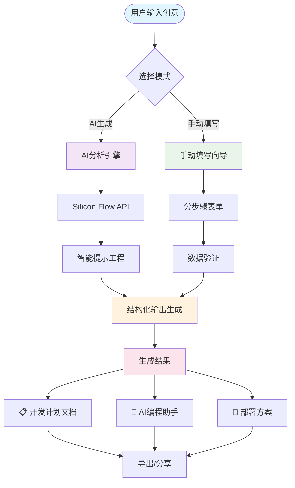
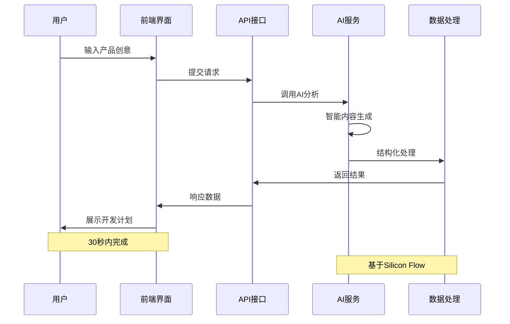

<div align="center">

# 🚀 VibeDoc - AI驱动的开发计划生成器

### 🔥 一键将创意转化为完整开发方案！

[](https://opensource.org/licenses/MIT)
[](https://gradio.app/)
[](https://www.python.org/)
[](https://modelscope.cn)

### 🌟 **在线体验地址**
[](https://www.modelscope.cn/studios/JasonRobert/Vibedocs/)

> 🏆 **参赛项目** - 魔塔MCP&Agent挑战赛2025 - Agent应用开发赛道

</div>

## 🎯 项目简介

VibeDoc 是一个基于 AI 的智能开发计划生成工具，专为魔塔MCP&Agent挑战赛2025 Agent应用开发赛道设计。帮助开发者和产品经理快速将创意转化为完整的技术开发方案。

### 📊 **项目数据**
- ⚡ **生成速度**: 30秒内完成完整开发计划
- 🔗 **MCP集成**: 支持3+种MCP服务智能路由
- 🤖 **AI模型**: 基于Qwen2.5-72B-Instruct
- 📋 **输出内容**: 6大模块结构化文档
- 🛠️ **技术栈**: Python + Gradio + AI + MCP

### 🌟 **核心亮点**
- 🧠 **AI 智能生成**：30秒内将创意转化为完整开发计划
- 🔗 **多源知识融合**：支持DeepWiki和通用网页内容参考
- 🛠️ **智能路由系统**：自动选择合适的MCP服务获取外部知识
- 📋 **结构化输出**：标准化的项目规划文档
- 🤖 **AI编程助手**：生成可直接使用的编程提示词
- 🎨 **概念LOGO生成**：自动生成项目视觉标识
- 📁 **一键下载**：支持Markdown文档导出

### 🏆 **Agent应用特色**
- 🔄 **多Agent协作**：DeepWiki + Fetch + Doubao无缝集成
- 🧠 **知识增强生成**：外部知识与AI深度融合
- 🎯 **自适应工作流**：根据输入类型智能选择处理策略
- 🛡️ **容错降级机制**：确保服务高可用性

## 🎬 系统架构与流程图

<div align="center">

### 🔄 核心工作流程



### 🏗️ 系统架构图

```mermaid
graph LR
    subgraph "前端层"
        A[React 19] --> B[Next.js 15]
        B --> C[TypeScript]
        C --> D[Tailwind CSS]
        D --> E[Shadcn/UI]
    end
    
    subgraph "API层"
        F[API Routes] --> G[数据验证]
        G --> H[业务逻辑]
    end
    
    subgraph "AI服务层"
        I[Silicon Flow API] --> J[Qwen2.5-72B]
        J --> K[智能提示工程]
    end
    
    subgraph "部署层"
        L[Docker容器] --> M[魔塔ModelScope]
        M --> N[云端服务]
    end
    
    E --> F
    H --> I
    K --> L
    
    style A fill:#61dafb
    style B fill:#000000
    style C fill:#3178c6
    style I fill:#ff6b6b
    style L fill:#0db7ed
```



### 📊 数据流向图



</div>

## 🎬 功能演示

### 💫 AI 生成模式 - 智能化体验

```
用户输入："我想做一个在线协作文档工具"
       ↓ (30秒AI分析)
自动生成：
├── 📋 产品规划 (痛点分析、功能设计、商业模式)
├── 🛠️ 技术方案 (React + Node.js + MongoDB)
├── 🚀 部署运维 (Docker + 云平台 + 性能优化)
├── 📈 营销策略 (用户增长、数据分析)
└── 🤖 AI 助手 (分步骤编程提示词)
```

### 🛠️ 手动填写模式 - 精确控制

- **步骤1**: 产品基本信息
- **步骤2**: 技术栈选择
- **步骤3**: 部署方案
- **步骤4**: 营销策略
- **随时切换**: 一键返回AI生成模式

## 🔥 应用场景

### 🎯 创业者
- **快速验证想法**：30秒获得完整的技术可行性分析
- **方案展示**：专业的技术方案文档
- **团队协作**：清晰的开发计划和时间线

### 👨‍💻 开发者
- **项目启动**：标准化的技术栈选择
- **架构设计**：专业的系统架构建议
- **AI 编程助手**：直接可用的编程提示词

### 🏢 产品经理
- **需求分析**：结构化的功能设计文档
- **技术沟通**：与开发团队的有效沟通工具
- **项目规划**：详细的开发计划和里程碑

## 🚀 快速体验

### 🌟 **在线体验（推荐）**
[](https://www.modelscope.cn/studios/JasonRobert/Vibedocs/)

**无需安装，打开即用！**

### 📱 **使用步骤**
1. **🔗 访问链接** → 点击上方体验按钮
2. **💡 输入创意** → 在文本框中描述你的产品想法
3. **🔗 添加参考**（可选）→ 输入相关网页链接作为参考
4. **🤖 AI 生成** → 点击生成按钮，30秒获得完整方案
5. **📋 获得结果** → 完整的开发计划 + AI编程提示词
6. **📁 下载保存** → 导出Markdown文档到本地

### 💡 **使用示例**
```
输入创意: "我想开发一个基于AI的代码审查工具，能够自动检测代码质量问题并给出优化建议"

30秒后获得:
├── 📋 完整产品规划 (市场分析、功能设计、商业模式)
├── 🛠️ 技术架构方案 (Python + FastAPI + AI模型)
├── 🚀 部署运维策略 (Docker + 云平台 + CI/CD)
├── 📈 推广营销计划 (开源社区 + 技术博客)
├── 🤖 AI编程助手 (直接可用的提示词)
└── 🎨 概念LOGO (自动生成的视觉标识)
```

### 🎯 **适用人群**
- 🚀 **创业者**: 快速验证产品想法和技术可行性
- 👨‍💻 **开发者**: 项目启动和架构设计参考
- 🏢 **产品经理**: 需求分析和团队沟通工具
- 🎓 **学生**: 课程项目和毕业设计规划

## 🏗️ 技术架构

### 🎨 **前端框架**
- **Gradio 5.34.1** - 🚀 快速构建ML Web应用
- **Python 3.11** - 🐍 现代化Python开发
- **HTML/CSS/JS** - 🎭 自定义UI组件增强

### 🧠 **AI技术栈**
- **Silicon Flow API** - 🌊 高性能大语言模型服务
- **Qwen2.5-72B-Instruct** - 🤖 智能内容生成模型
- **结构化提示工程** - 🎯 确保高质量输出

### ⚡ **性能优化**
- **异步处理** - 🚄 非阻塞式API调用
- **智能缓存** - 🏃‍♂️ 提升响应速度
- **容错机制** - 🛡️ 确保服务稳定性
- **CDN 加速** - 🌍 全球内容分发

## 🔌 MCP服务集成

### 🧠 智能路由系统

VibeDoc 集成了多个 MCP (Model Context Protocol) 服务，实现智能路由功能：

- **🔍 DeepWiki MCP**: 专门处理 `deepwiki.org` 链接，提供深度技术文档解析
- **🌐 Fetch MCP**: 处理通用网页链接，支持博客、新闻、文档等多种内容类型
- **⚡ 智能选择**: 系统根据URL自动选择最合适的MCP服务

### 📋 使用方式

1. **输入创意**: 在主输入框中描述你的产品想法
2. **添加参考**: 在"参考链接"框中输入任何相关网页链接
   - DeepWiki链接: 自动使用DeepWiki MCP服务
   - 其他网页: 自动使用Fetch MCP服务
3. **AI生成**: 系统会融合外部知识生成更准确的开发计划

### 🔧 技术特点

- **自动识别**: 无需手动选择服务类型
- **错误恢复**: 完整的异常处理和日志记录
- **性能优化**: 30秒超时设置，确保响应速度
- **知识融合**: 外部内容智能注入到AI提示词中

## 🎯 Agent应用开发赛道亮点

### 🌟 创新性
- **🤖 Agent智能协作**：多MCP服务协同工作，提供综合性开发建议
- **🔗 知识图谱融合**：整合外部知识源，生成更准确的技术方案  
- **🎯 智能路由系统**：根据输入自动选择最佳的知识获取策略
- **⚡ 实时内容整合**：动态获取最新技术文档和行业趋势

### 💎 Agent应用价值
- **🧠 多源智能决策**：结合AI推理与外部知识库的复合决策系统
- **🔄 自适应工作流**：根据用户输入智能调整处理流程
- **📊 知识增强生成**：外部内容与AI能力深度融合，提升输出质量
- **🛡️ 容错与降级**：完善的错误处理，确保服务可用性

### 🔧 实用性
- **解决痛点**：帮助开发者快速启动项目，减少80%规划时间
- **提高效率**：标准化的开发计划模板，融合最新技术趋势
- **知识沉淀**：可复用的项目规划方法论，持续学习外部知识
- **智能推荐**：基于外部参考自动调整技术栈和架构建议

## 🌈 魔塔平台部署指南

### 🚀 部署配置

**项目仓库：** `https://github.com/JasonRobertDestiny/VibeDocs.git`  
**分支：** `modelscope`  
**SDK：** `Docker`  
**端口：** `3000`  

### ⚙️ 正确的服务配置

**重要提醒：** 请使用以下配置来解决MCP服务连接问题：

```json
{
  "mcpServers": {
    "vibedoc": {
      "command": "sh",
      "args": [
        "-c",
        "npm run build && npm start"
      ],
      "env": {
        "NODE_ENV": "production",
        "PORT": "3000",
        "SILICONFLOW_API_KEY": "${SILICONFLOW_API_KEY}"
      }
    }
  }
}
```

**配置说明：**
- 使用 `sh` 命令来执行链式操作
- 先执行 `npm run build` 构建项目
- 构建成功后执行 `npm start` 启动服务
- 确保环境变量正确传递

### 🔧 环境变量配置

| 变量名 | 描述 | 示例值 | 是否必填 |
|--------|------|--------|----------|
| `SILICONFLOW_API_KEY` | Silicon Flow API密钥，用于AI内容生成 | `sk-xxx...` | ✅ 必填 |
| `DEEPWIKI_SSE_URL` | DeepWiki MCP服务URL，用于解析deepwiki.org链接 | `http://localhost:8080` | ⚠️ 可选 |
| `FETCH_SSE_URL` | Fetch MCP服务URL，用于解析通用网页链接 | `http://localhost:8081` | ⚠️ 可选 |
| `NODE_ENV` | Node.js运行环境 | `production` | ✅ 必填 |
| `PORT` | 应用服务端口 | `3000` | ✅ 必填 |

**注意事项:**
- 🔴 `SILICONFLOW_API_KEY` 是必填项，应用无法正常工作
- 🟡 MCP服务URL是可选的，如果不配置对应功能将不可用
- 🟢 如果只配置了一个MCP服务，系统会自动降级到可用的服务

### 📋 部署步骤

1. **导入项目**：使用 GitHub 仓库地址
2. **选择分支**：`modelscope`
3. **配置服务**：复制上面的正确服务配置JSON
4. **设置环境变量**：按上表配置所有必需变量
5. **启动部署**：等待构建和启动完成
6. **验证部署**：访问应用并测试功能

### 🛠️ 常见问题解决

**问题1：MCP服务连接失败**
- **原因**：缺少构建步骤，直接执行 `npm start` 失败
- **解决**：使用上面提供的正确服务配置

**问题2：环境变量未生效**
- **原因**：环境变量名称不匹配或未正确设置
- **解决**：确保环境变量名称与代码中使用的完全一致

**问题3：端口占用或无法访问**
- **原因**：端口配置不正确
- **解决**：确保 `PORT` 环境变量设置为 `3000`

### 🎯 服务描述配置

```
VibeDoc 是一个AI驱动的智能开发计划生成器，专为魔塔MCP&Agent挑战赛2025 Agent应用开发赛道设计。

🔥 核心功能：
• 一键将创意转化为完整开发方案
• 多MCP服务智能路由，融合外部知识源
• 30秒内生成包含技术栈、架构设计、部署方案的完整文档
• 自动生成AI编程助手提示词
• 支持DeepWiki和通用网页内容解析

🎯 Agent应用特色：
• 智能路由系统：自动选择最佳MCP服务
• 知识增强生成：外部内容与AI深度融合
• 多源协作决策：整合多个知识源提供综合建议
• 自适应工作流：根据输入类型调整处理策略
• 容错降级机制：确保服务高可用性

🏆 赛道价值：
• 展示Agent应用在开发工具领域的创新实践
• 深度集成多个MCP服务，提升开发效率
• 标准化项目规划流程，推动行业最佳实践
• 实现智能化的知识获取和决策支持系统

适用于创业者、开发者、产品经理等角色，解决项目规划难题，提升开发效率。
```

## 🛠️ 本地开发

### 📋 环境要求
- Node.js 18+
- npm 或 yarn 或 pnpm

### 🚀 快速启动

```bash
# 1. 克隆项目
git clone https://github.com/JasonRobertDestiny/VibeDocs.git
cd VibeDocs

# 2. 切换到modelscope分支
git checkout modelscope

# 3. 安装依赖
npm install

# 4. 配置环境变量
cp .env.local.example .env.local
# 编辑 .env.local 文件，添加你的 Silicon Flow API Key

# 5. 启动开发服务器
npm run dev

# 6. 访问应用
# 打开 http://localhost:3000
```

### 🔑 API Key 配置

在 `.env.local` 文件中配置：
```env
SILICONFLOW_API_KEY=your_api_key_here
```

> 💡 **提示**：在 [Silicon Flow](https://siliconflow.cn) 注册并获取免费的 API Key

### 📁 项目结构

```
VibeDocs/
├── 🎯 app/                    # Next.js App Router
│   ├── 🔌 api/               # API 路由
│   │   └── auto-generate-plan/  # AI 生成接口
│   ├── 🎨 globals.css        # 全局样式
│   ├── 📄 layout.tsx         # 根布局
│   └── 🏠 page.tsx          # 主页面
├── 🧩 components/            # React 组件
│   └── 💎 ui/               # UI 组件库
├── 🛠️ lib/                   # 工具库
│   ├── 📋 sop-template.ts   # 开发计划模板
│   └── 🔧 utils.ts          # 工具函数
├── 📂 public/               # 静态资源
└── ⚙️ 配置文件...
```

## 🔌 API 接口

### POST /api/auto-generate-plan

🎯 **功能**：根据用户输入的创意生成完整的开发计划

**请求示例：**
```json
{
  "idea": "我想做一个在线协作文档工具，类似于腾讯文档"
}
```

**响应示例：**
```json
{
  "success": true,
  "plan": {
    "productName": "DocuShare - 智能协作文档平台",
    "techStack": "React + Node.js + MongoDB + Socket.io",
    "deploymentPlan": "Docker + 云平台 + MongoDB Atlas",
    "marketingStrategy": "社交媒体推广 + 免费试用 + 企业客户",
    "aiAssistant": "分步骤编程提示词..."
  },
  "originalIdea": "我想做一个在线协作文档工具，类似于腾讯文档",
  "fieldIds": ["product", "tech", "deployment", "marketing", "ai"]
}
```

## 🏆 赛道价值展示

### 🎯 解决的核心痛点

| 痛点 | 传统方式 | VibeDoc 解决方案 |
|------|----------|------------------|
| 📋 **项目规划耗时** | 2-3天制定方案 | 30秒AI生成 |
| 🤔 **技术选型困难** | 需要大量调研 | 智能推荐最佳方案 |
| 📖 **文档编写复杂** | 手动编写，格式混乱 | 结构化专业文档 |
| 🚀 **部署方案缺失** | 缺乏系统性规划 | 完整部署运维方案 |
| 🤖 **AI助手配置** | 需要专业知识 | 自动生成提示词 |

### 💡 创新技术应用

- **🧠 智能提示工程**：精心设计的 Prompt 模板，确保高质量结构化输出
- **🔄 双模式切换**：AI生成与手动填写无缝切换，满足不同需求
- **📊 数据可视化**：清晰的项目规划图表和时间线
- **🎨 现代化界面**：基于 Shadcn/UI 的精美用户界面

## 🤝 参与贡献

### 🎯 如何贡献

我们欢迎所有形式的贡献！

- 🐛 **报告 Bug**：发现问题请提交 Issue
- 💡 **功能建议**：有好想法请告诉我们
- 🛠️ **代码贡献**：提交 Pull Request
- 📖 **文档改进**：帮助完善文档

### 📋 贡献流程

1. **Fork 项目** 🍴
2. **创建功能分支** 🌿
   ```bash
   git checkout -b feature/amazing-feature
   ```
3. **提交代码** 💾
   ```bash
   git commit -m 'Add amazing feature'
   ```
4. **推送分支** 🚀
   ```bash
   git push origin feature/amazing-feature
   ```
5. **创建 Pull Request** 📝

## 📄 许可证

本项目基于 MIT 许可证开源 - 详见 [LICENSE](LICENSE) 文件

## 📞 联系方式

<div align="center">

### 🚀 **在线体验**
[](https://www.modelscope.cn/studios/JasonRobert/Vibedocs/)

### 🧑‍💻 **开发者联系方式**

[](mailto:johnrobertdestiny@gmail.com)

[](https://github.com/JasonRobertDestiny)

[](https://blog.csdn.net/Soulrobert520)

[](https://juejin.cn/user/2637056597039172)

[](https://space.bilibili.com/648236073)

### 📋 **项目信息**

[](https://github.com/JasonRobertDestiny/VibeDocs)

[](https://www.modelscope.cn/studios/JasonRobert/Vibedocs/)

---

### 💬 **技术交流**

- 🤝 **合作洽谈**: 通过邮箱联系
- 💡 **技术讨论**: CSDN博客留言
- 🎯 **项目反馈**: GitHub Issues
- 📺 **技术分享**: B站关注获取最新动态

</div>

---

<div align="center">

### 🎯 **立即体验 VibeDoc，30秒内获得完整开发方案！**

**⭐ 如果这个项目对你有帮助，请给个 Star ⭐**

Made with ❤️ for **Agent Application Development Track**

🏆 **魔塔MCP&Agent挑战赛2025** 🏆

</div>
