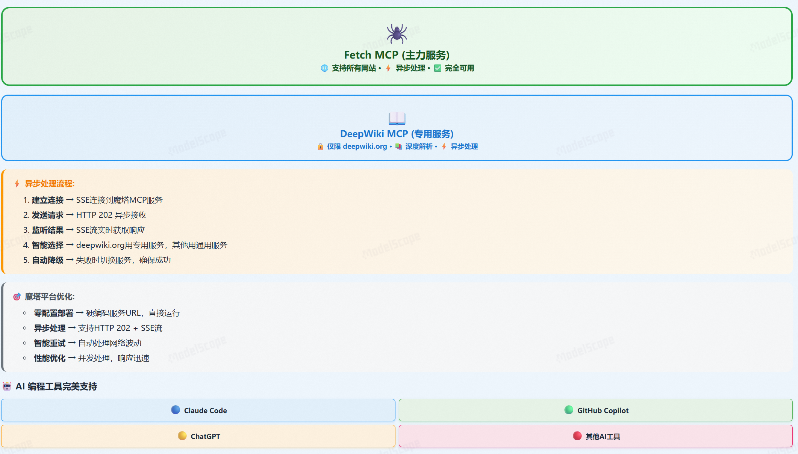

# 🚀 VibeDoc - AI Development Plan Generator

[](https://opensource.org/licenses/MIT)
[](https://www.python.org/downloads/)
[](https://gradio.app/)
[](CONTRIBUTING.md)

<div align="center">

**Transform Ideas into Complete Development Plans in 60-180 Seconds**

Your AI Product Manager & Architect - Intelligently Generate Technical Documentation, Architecture Diagrams, and AI Coding Prompts

[🎬 Demo Video](https://www.bilibili.com/video/BV1ieagzQEAC/) | [📖 Documentation](./docs) | [🤝 Contributing](./CONTRIBUTING.md) | [💬 Discussions](https://github.com/JasonRobertDestiny/VibeDoc/discussions) | [中文文档](./README.zh.md)

</div>

---

## ✨ Why VibeDoc?

As a developer, product manager, or entrepreneur, have you encountered these challenges:

- 💭 **Great Ideas, No Plan?** Many ideas, but don't know how to convert them into executable development plans
- ⏰ **Documentation Takes Too Long?** Writing technical proposals and architecture docs consumes massive time
- 🤖 **AI Tools Confusing?** Want AI-assisted coding but don't know how to write effective prompts
- 📊 **Missing Professional Diagrams?** Need architecture, flow, and Gantt charts but unfamiliar with tools

**VibeDoc Solves It All!**


## 🎯 Core Features

### 📋 Intelligent Development Plan Generation

Enter your product idea, AI automatically generates a complete development plan including:

- **Product Overview** - Background, target users, core value
- **Technical Solution** - Tech stack selection, architecture design, technology comparison
- **Development Plan** - Phased implementation, timeline, resource allocation
- **Deployment Strategy** - Environment setup, CI/CD pipeline, operations monitoring
- **Growth Strategy** - Market positioning, operations advice, growth tactics

### 🤖 AI Coding Prompt Generation

Generate ready-to-use AI coding prompts for each feature module, supporting:

- ✅ **Claude** - Code generation, architecture design
- ✅ **GitHub Copilot** - Intelligent code completion
- ✅ **ChatGPT** - Technical consultation, code optimization
- ✅ **Cursor** - AI-assisted programming


### 📊 Auto-Generated Visual Diagrams

Automatically generate professional diagrams using Mermaid:

- 🏗️ **System Architecture** - Clearly show component relationships
- 📈 **Business Flowcharts** - Visualize business logic
- 📅 **Gantt Charts** - Project timeline at a glance
- 📊 **Tech Comparison Tables** - Technology selection reference

### 📁 Multi-Format Export

One-click export for different scenarios:

- **Markdown** (.md) - Perfect for version control, GitHub display
- **Word** (.docx) - Business documents, project reports
- **PDF** (.pdf) - Formal proposals, print archives
- **HTML** (.html) - Web display, online sharing



## 🚀 Quick Start

### Requirements

- Python 3.11+
- pip package manager
- [SiliconFlow API Key](https://siliconflow.cn) (free to obtain)

### Installation

```bash
# 1. Clone the repository
git clone https://github.com/JasonRobertDestiny/VibeDoc.git
cd VibeDoc

# 2. Create virtual environment (recommended)
python -m venv venv

# Activate virtual environment
# Windows:
venv\Scripts\activate
# macOS/Linux:
source venv/bin/activate

# 3. Install dependencies
pip install -r requirements.txt

# 4. Configure environment variables
cp .env.example .env
# Edit .env file and add your API Key
```

### Configuration

Configure in `.env` file:

```env
# Required: SiliconFlow API Key (free registration)
SILICONFLOW_API_KEY=your_api_key_here

# Optional: Advanced Configuration
API_TIMEOUT=300
LOG_LEVEL=INFO
ENVIRONMENT=production
```

### Run Application

```bash
python app.py
```

Application will start at:
- Local: http://localhost:7860
- Network: http://0.0.0.0:7860

### 🐳 Docker Deployment (Optional)

```bash
# Build image
docker build -t vibedoc .

# Run container
docker run -p 7860:7860 \
  -e SILICONFLOW_API_KEY=your_key \
  vibedoc
```

## 💡 Usage Examples

### Example 1: Web Application Development

**Input:**
```
Develop an online collaborative document editor supporting
real-time multi-user editing, version management, and commenting,
similar to Google Docs
```

**Output:** [View Complete Example](./HandVoice%20Development%20Plan.md)

Generated content includes:
- Complete technical architecture (React + Node.js + WebSocket)
- 6-month development plan with 3 milestones
- 10+ ready-to-use AI coding prompts
- Architecture diagrams, flowcharts, Gantt charts

### Example 2: AI Application Development

**Input:**
```
Intelligent customer service system: multi-turn dialogue,
sentiment analysis, knowledge base search, automatic ticket
generation, smart reply recommendations
```

Reference URL: `https://docs.python.org/3/library/asyncio.html`

**Output:**
- LLM-based dialogue system architecture
- Knowledge base construction and retrieval solution
- Sentiment analysis model integration
- Complete implementation roadmap

## 🏗️ Technical Architecture

VibeDoc adopts a modular architecture:

```
┌─────────────────────────────────────────┐
│         Gradio Web Interface            │
│  (UI + Rendering + File Export)         │
└─────────────────┬───────────────────────┘
                  │
┌─────────────────▼───────────────────────┐
│       Core Processing Engine            │
├─────────────────────────────────────────┤
│  • Input Validation & Optimization      │
│  • AI Generation Coordination           │
│  • Content Quality Control              │
│  • Multi-format Export                  │
└──┬────────┬──────────┬─────────┬────────┘
   │        │          │         │
   ▼        ▼          ▼         ▼
┌──────┐ ┌────────┐ ┌──────┐ ┌──────────┐
│AI    │ │Prompt  │ │Content│ │Export    │
│Model │ │Optimizer│ │Validator│ │Manager   │
└──────┘ └────────┘ └──────┘ └──────────┘
```

### Technology Stack

- **Frontend**: Gradio 5.34.1 - Fast AI app interface
- **AI Model**: Qwen2.5-72B-Instruct - Alibaba Cloud's Tongyi Qianwen
- **Chart Rendering**: Mermaid.js - Professional diagram generation
- **Document Export**: python-docx, reportlab - Multi-format support
- **Async Processing**: asyncio, aiofiles - High-performance async

## 📊 Performance Metrics

| Metric | Performance |
|--------|-------------|
| **Generation Speed** | 60-180 seconds for complete plan |
| **Success Rate** | >95% successful generation |
| **Content Quality** | Average quality score 85/100 |
| **Export Formats** | 4 professional document formats |

## 🎨 Use Cases

### 👨‍💻 Developers
- ✅ Quickly validate technical feasibility
- ✅ Generate project technical documentation
- ✅ Get AI coding assistant prompts
- ✅ Learn architecture best practices

### 📊 Product Managers
- ✅ Transform requirements into technical solutions
- ✅ Generate project planning documents
- ✅ Estimate development cycles and resources
- ✅ Create project proposals

### 🎓 Students & Learners
- ✅ Learn software development best practices
- ✅ Understand technical architecture design
- ✅ Prepare for technical interviews
- ✅ Complete graduation project planning

### 🚀 Entrepreneurs
- ✅ Quickly validate product ideas
- ✅ Generate technical plans for investors
- ✅ Plan MVP development roadmap
- ✅ Assess technical implementation costs

## 🤝 Contributing

We welcome all forms of contribution!

- 🐛 Report Bugs
- 💡 Suggest New Features
- 📝 Improve Documentation
- 🔧 Submit Code

### Contribution Steps

1. Fork this project
2. Create feature branch (`git checkout -b feature/AmazingFeature`)
3. Commit changes (`git commit -m 'Add some AmazingFeature'`)
4. Push to branch (`git push origin feature/AmazingFeature`)
5. Submit Pull Request

For detailed guidelines, see [CONTRIBUTING.md](./CONTRIBUTING.md)

## 📝 Documentation

- [User Guide](./USER_GUIDE.md) - Detailed usage instructions
- [Technical Docs](./CLAUDE.md) - Code architecture and development guide
- [Deployment Guide](./DEPLOYMENT.md) - Production environment deployment
- [Security Policy](./SECURITY.md) - Security best practices

## 🎯 Roadmap

### v2.1 (Planned)
- [ ] Support more AI models (GPT-4, Claude, etc.)
- [ ] Team collaboration features
- [ ] Plan version management
- [ ] Online editor

### v2.2 (Planned)
- [ ] Mobile adaptation
- [ ] Multi-language support (English, Japanese)
- [ ] Template marketplace
- [ ] API interface

## 🙏 Acknowledgments

- **Qwen2.5-72B-Instruct** by Alibaba Cloud - Powerful AI capabilities
- **Gradio** - Excellent web framework
- **SiliconFlow** - Stable API services
- All contributors and users ❤️

## 📄 License

This project is licensed under the [MIT License](LICENSE)

## 📞 Contact

- **Issues**: [GitHub Issues](https://github.com/JasonRobertDestiny/VibeDoc/issues)
- **Discussions**: [GitHub Discussions](https://github.com/JasonRobertDestiny/VibeDoc/discussions)
- **Email**: johnrobertdestiny@gmail.com
- **Demo Video**: [Bilibili](https://www.bilibili.com/video/BV1ieagzQEAC/)

## ⭐ Star History

If this project helps you, please give us a Star ⭐!

[](https://star-history.com/#JasonRobertDestiny/VibeDoc&Date)

---

<div align="center">

**🚀 Empower Every Idea with AI**

Made with ❤️ by the VibeDoc Team

</div>
