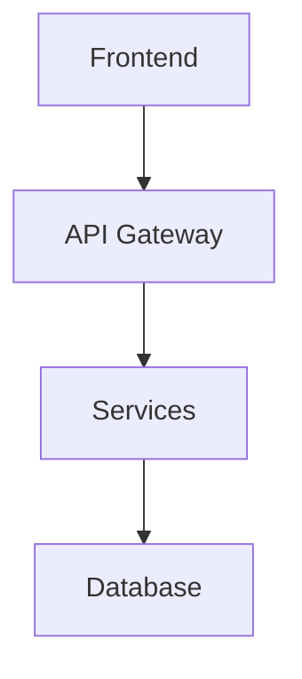

# 📖 User Guide - VibeDoc

Welcome to VibeDoc! This guide will help you get the most out of our AI-powered development plan generator.

## 🚀 Getting Started

### Step 1: Describe Your Idea

Enter your product or project idea in the text box. Be as detailed as possible:

**Good Example:**
```
A mobile fitness app that helps users track workouts, plan meals, 
and connect with personal trainers. Features include:
- Workout library with video demonstrations
- Calorie and macro tracking
- Social features to share progress
- Integration with wearable devices
- AI-powered workout recommendations
```

**Basic Example:**
```
A fitness tracking app
```

💡 **Tip**: More detail = better results! Include features, target users, and key requirements.

### Step 2: Add Reference (Optional)

If you have a reference URL (documentation, similar project, article), add it:
- GitHub repositories
- Official documentation
- Technical articles
- Related projects

This helps the AI understand context and provide more accurate recommendations.

### Step 3: Optimize Your Input (Optional)

Click **"✨ Optimize Description"** to enhance your idea with AI:
- Expands brief descriptions
- Adds technical context
- Suggests additional features
- Improves clarity

### Step 4: Generate Plan

Click **"🤖 Generate Development Plan"** and wait 60-180 seconds.

## 📊 Understanding Your Results

Your generated plan includes:

### 1. 📋 Development Plan

**Product Overview**
- Core concept
- Target audience
- Key features
- Value proposition

**Technical Architecture**
- System design diagrams
- Technology stack recommendations
- Architecture patterns
- Integration points

**Development Roadmap**
- Phase breakdown
- Timeline estimates
- Milestones
- Resource requirements

**Deployment Strategy**
- Infrastructure recommendations
- CI/CD pipeline
- Monitoring and maintenance
- Scaling considerations

### 2. 🤖 AI Coding Prompts

Ready-to-use prompts for AI coding assistants like:
- GitHub Copilot
- ChatGPT/Claude
- Cursor
- Other AI tools

Each prompt is tailored to specific features and includes:
- Context and requirements
- Technical constraints
- Expected output
- Best practices

### 3. 📊 Visual Diagrams

**Architecture Diagrams**


**Gantt Charts**
- Project timeline
- Task dependencies
- Milestone dates

## 💾 Exporting Your Plan

### Copy to Clipboard

1. **📋 Copy Development Plan** - Full technical documentation
2. **🤖 Copy AI Prompts** - Just the coding prompts

### Download Files

Click **"📁 Download"** to get:
- Markdown (.md) - Version control friendly
- Word (.docx) - Business presentations
- PDF (.pdf) - Professional documents

## 🎯 Tips for Best Results

### 1. Be Specific About Features

❌ **Vague**: "A social media app"

✅ **Specific**: "A photo-sharing social network like Instagram, with filters, stories, direct messaging, and hashtag discovery"

### 2. Include Technical Requirements

Mention if you need:
- Specific technologies (React, Python, etc.)
- Platform constraints (web, mobile, both)
- Performance requirements
- Security needs
- Integration requirements

### 3. Define Your Audience

Who will use this?
- Demographics
- Technical expertise
- Use cases
- Pain points

### 4. Use Reference URLs Wisely

Good references:
- Official documentation
- Open-source projects
- Technical specifications
- Industry standards

Avoid:
- Marketing pages
- Generic articles
- Unrelated content

## 🔧 Advanced Features

### Prompt Optimization

The optimizer enhances your input by:
1. Analyzing intent and context
2. Adding technical details
3. Suggesting improvements
4. Expanding brief descriptions

### Quality Validation

Behind the scenes, VibeDoc:
- Validates technical accuracy
- Checks link validity
- Ensures format consistency
- Optimizes diagram rendering

### Multi-format Export

Choose the format that fits your needs:
- **Markdown**: For GitHub, GitLab, technical docs
- **Word**: For stakeholder presentations
- **PDF**: For formal proposals, printing

## 🎨 UI Features

### Dark Mode

Toggle between light and dark themes for comfortable viewing.

### Responsive Design

Works perfectly on:
- Desktop computers
- Tablets
- Mobile phones

### Keyboard Shortcuts

- `Ctrl/Cmd + Enter`: Generate plan
- `Ctrl/Cmd + C`: Copy (when text selected)

## ❓ Troubleshooting

### Generation Takes Too Long

- **Normal**: 60-180 seconds for complex projects
- **Check**: Internet connection
- **Try**: Simplify your description first

### Plan Quality Issues

- **Add more detail** to your description
- **Use specific technical terms**
- **Include a reference URL**
- **Try optimizing your input** first

### Export Not Working

- **Check browser** (use modern browser)
- **Disable ad blockers** temporarily
- **Try different format**
- **Clear browser cache**

### Diagrams Not Rendering

- **Wait a few seconds** for rendering
- **Refresh the page**
- **Try different browser**
- **Check browser console** for errors

## 💡 Common Use Cases

### For Developers

**Project Planning**
1. Enter your app idea
2. Get architecture recommendations
3. Use AI prompts to start coding

**Technical Documentation**
1. Describe existing project
2. Generate updated documentation
3. Export for team review

### For Project Managers

**Client Proposals**
1. Input client requirements
2. Generate comprehensive plan
3. Export to Word/PDF for presentation

**Resource Estimation**
1. Describe project scope
2. Review timeline and phases
3. Plan team allocation

### For Students

**Learning Projects**
1. Enter project idea
2. Understand best practices
3. Follow generated roadmap

**Interview Preparation**
1. Practice system design
2. Study architecture patterns
3. Learn project planning

## 🤝 Getting Help

### Documentation

- **README**: Project overview and setup
- **CONTRIBUTING**: How to contribute
- **VISION**: Product roadmap

### Community

- **GitHub Discussions**: Q&A and ideas
- **GitHub Issues**: Bug reports and features
- **Email**: johnrobertdestinv@gmail.com
- **Demo Video**: [Watch on Bilibili](https://www.bilibili.com/video/BV1ieagzQEAC/)

### Resources

- **Examples**: Check the example use cases
- **Blog**: Tips and tutorials (coming soon)
- **Videos**: Walkthrough guides (coming soon)

## 🚀 Next Steps

1. **Try it now** with one of the example ideas
2. **Experiment** with different descriptions
3. **Share** your results with the team
4. **Contribute** your own ideas and improvements

---

**Need more help?** Check our [FAQ](./FAQ.md) or [open an issue](https://github.com/JasonRobertDestiny/VibeDoc/issues/new)!

Happy planning! 🎉
