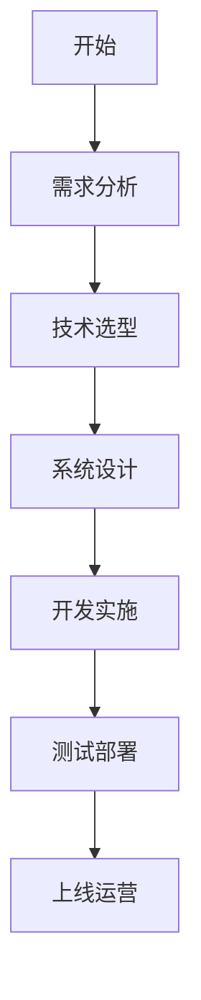
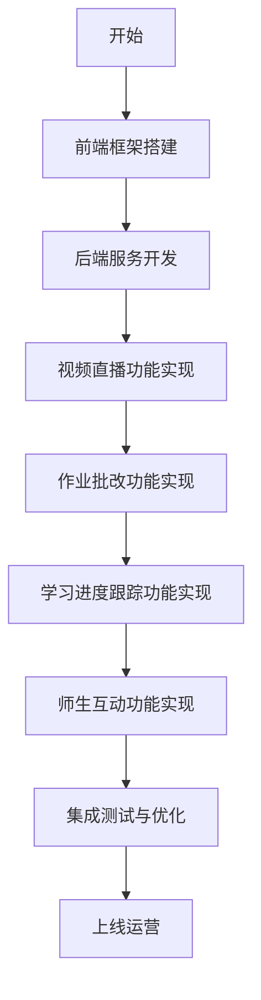

<div class="plan-header">


# 🚀 AI生成的开发计划

<div class="meta-info">


**⏰ 生成时间：** 2025-07-12 18:13:52  
**🤖 AI模型：** Qwen2.5-72B-Instruct  
**💡 基于用户创意智能分析生成**  
**🔗 Agent应用MCP服务增强**

</div>

</div>

---

### 在线教育平台开发计划

#### 1. 产品概述

在线教育平台旨在提供一个全面的教育解决方案，支持视频直播、作业批改、学习进度跟踪和师生互动功能。平台将帮助教师高效地管理课程，同时为学生提供丰富的学习资源和互动体验。

#### 2. 技术方案

##### 2.1 技术选型

- **前端**：React.js + Redux
- **后端**：Node.js + Express
- **数据库**：MongoDB
- **实时通信**：WebRTC + Socket.io
- **视频直播**：Wowza Media Server
- **作业批改**：自然语言处理（NLP）技术
- **学习进度跟踪**：MongoDB + Redis
- **师生互动**：WebRTC + Socket.io

##### 2.2 技术栈对比表格

| 技术栈             | 优点                 | 缺点             |
| ------------------ | -------------------- | ---------------- |
| React.js           | 开发效率高，社区活跃 | 学习曲线较陡     |
| Node.js + Express  | 高性能，响应快       | 可能出现回调地狱 |
| MongoDB            | 灵活的数据模型       | 不适合复杂查询   |
| WebRTC + Socket.io | 实时通信流畅         | 配置复杂         |
| Wowza Media Server | 稳定的视频直播服务   | 成本较高         |
| NLP技术            | 自动化批改，提高效率 | 准确率有待提高   |

#### 3. 开发计划

##### 3.1 需求分析

- **目标用户**：学生和教师
- **核心功能**：视频直播、作业批改、学习进度跟踪、师生互动
- **用户故事**：描述用户在平台上的主要活动

##### 3.2 系统设计

- **架构图**：



##### 3.3 开发实施

#### 🚀 第1阶段：前端框架搭建


#### 🚀 第2阶段：后端服务开发


#### 🚀 第3阶段：视频直播功能实现


#### 🚀 第4阶段：作业批改功能实现


#### 🚀 第5阶段：学习进度跟踪功能实现


#### 🚀 第6阶段：师生互动功能实现


#### 🚀 第7阶段：集成测试与优化


##### 3.4 测试部署

- **单元测试**：确保每个模块的正确性
- **集成测试**：确保模块间的协同工作
- **性能测试**：确保系统在高负载下的稳定性
- **部署**：使用Docker和Kubernetes进行容器化部署

##### 3.5 上线运营

- **用户培训**：提供详细的使用手册和培训课程
- **用户反馈**：建立用户反馈机制，持续优化产品
- **市场推广**：通过社交媒体、教育机构合作等方式推广平台

#### 4. 部署方案

- **环境准备**：配置服务器、数据库、负载均衡等
- **容器化**：使用Docker和Kubernetes进行容器化部署
- **持续集成/持续部署（CI/CD）**：使用Jenkins进行自动化构建和部署

#### 5. 推广策略

- **目标市场**：K-12教育、高等教育、职业教育
- **渠道**：社交媒体、教育机构合作、线上广告、线下活动
- **用户激励**：提供免费试用、优惠券、推荐奖励等

### 甘特图

```mermaid
gantt
    title 项目开发甘特图
    dateFormat YYYY-MM-DD
    section 需求分析
    需求分析     :a1, 2024-01-01, 7d
    section 系统设计
    系统设计     :a2, after a1, 14d

#### 🚀 第1阶段：前端框架搭建

    前端框架搭建 :a3, after a2, 14d

#### 🚀 第2阶段：后端服务开发

    后端服务开发 :a4, after a3, 14d

#### 🚀 第3阶段：视频直播功能实现

    视频直播功能实现 :a5, after a4, 14d

#### 🚀 第4阶段：作业批改功能实现

    作业批改功能实现 :a6, after a5, 14d

#### 🚀 第5阶段：学习进度跟踪功能实现

    学习进度跟踪功能实现 :a7, after a6, 14d

#### 🚀 第6阶段：师生互动功能实现

    师生互动功能实现 :a8, after a7, 14d

#### 🚀 第7阶段：集成测试与优化

    集成测试与优化 :a9, after a8, 14d
```

### 功能模块流程图



###

---


<div class="prompts-highlight">


# 🤖 AI编程助手提示词

> 💡 **使用说明**：以下提示词基于您的项目需求定制生成，可直接复制到 Claude Code、GitHub Copilot、ChatGPT 等AI编程工具中使用


#### 视频直播功能开发提示词

<div class="prompt-code-block">


```prompt
请为在线教育平台开发视频直播功能。

项目背景：
在线教育平台旨在提供一个全面的教育解决方案，支持视频直播、作业批改、学习进度跟踪和师生互动功能。平台将帮助教师高效地管理课程，同时为学生提供丰富的学习资源和互动体验。

功能要求：
1. 实现教师端的视频直播功能，包括摄像头和麦克风的使用。
2. 实现学生端的视频观看功能，支持实时互动。
3. 提供直播录像功能，方便学生回看。
4. 支持多房间管理，每个教师可以创建多个直播间。

技术约束：
- 使用WebRTC实现实时通信
- 使用Wowza Media Server实现视频直播
- 使用React.js开发前端界面
- 使用Node.js + Express开发后端服务
- 遵循RESTful API规范
- 实现高并发支持

输出要求：
- 完整可运行代码
- 详细注释说明
- 错误处理机制
- 测试用例
```

<div class="prompt-copy-section">
<button class="individual-copy-btn" data-prompt-id="0" data-prompt-content="请为在线教育平台开发视频直播功能。\n\n项目背景：\n在线教育平台旨在提供一个全面的教育解决方案，支持视频直播、作业批改、学习进度跟踪和师生互动功能。平台将帮助教师高效地管理课程，同时为学生提供丰富的学习资源和互动体验。\n\n功能要求：\n1. 实现教师端的视频直播功能，包括摄像头和麦克风的使用。\n2. 实现学生端的视频观看功能，支持实时互动。\n3. 提供直播录像功能，方便学生回看。\n4. 支持多房间管理，每个教师可以创建多个直播间。\n\n技术约束：\n- 使用WebRTC实现实时通信\n- 使用Wowza Media Server实现视频直播\n- 使用React.js开发前端界面\n- 使用Node.js + Express开发后端服务\n- 遵循RESTful API规范\n- 实现高并发支持\n\n输出要求：\n- 完整可运行代码\n- 详细注释说明\n- 错误处理机制\n- 测试用例">
    📋 复制此提示词
</button>
<span class="copy-success-msg" id="copy-success-0" style="display: none; color: #28a745; margin-left: 10px;">✅ 已复制!</span>
</div>


</div>

</div>


#### 作业批改功能开发提示词

<div class="prompt-code-block">


```prompt
请为在线教育平台开发作业批改功能。

项目背景：
在线教育平台旨在提供一个全面的教育解决方案，支持视频直播、作业批改、学习进度跟踪和师生互动功能。平台将帮助教师高效地管理课程，同时为学生提供丰富的学习资源和互动体验。

功能要求：
1. 实现教师端的作业发布功能，支持多种题型（选择题、填空题、简答题等）。
2. 实现学生端的作业提交功能，支持文本、图片、文件上传。
3. 实现自动批改功能，支持选择题和填空题的自动评分。
4. 提供人工批改功能，支持教师对简答题进行手动评分。
5. 生成批改报告，包括成绩和反馈。

技术约束：
- 使用自然语言处理（NLP）技术实现自动批改
- 使用MongoDB存储作业数据
- 使用React.js开发前端界面
- 使用Node.js + Express开发后端服务
- 遵循RESTful API规范
- 实现高并发支持

输出要求：
- 完整可运行代码
- 详细注释说明
- 错误处理机制
- 测试用例
```

<div class="prompt-copy-section">
<button class="individual-copy-btn" data-prompt-id="0" data-prompt-content="请为在线教育平台开发作业批改功能。\n\n项目背景：\n在线教育平台旨在提供一个全面的教育解决方案，支持视频直播、作业批改、学习进度跟踪和师生互动功能。平台将帮助教师高效地管理课程，同时为学生提供丰富的学习资源和互动体验。\n\n功能要求：\n1. 实现教师端的作业发布功能，支持多种题型（选择题、填空题、简答题等）。\n2. 实现学生端的作业提交功能，支持文本、图片、文件上传。\n3. 实现自动批改功能，支持选择题和填空题的自动评分。\n4. 提供人工批改功能，支持教师对简答题进行手动评分。\n5. 生成批改报告，包括成绩和反馈。\n\n技术约束：\n- 使用自然语言处理（NLP）技术实现自动批改\n- 使用MongoDB存储作业数据\n- 使用React.js开发前端界面\n- 使用Node.js + Express开发后端服务\n- 遵循RESTful API规范\n- 实现高并发支持\n\n输出要求：\n- 完整可运行代码\n- 详细注释说明\n- 错误处理机制\n- 测试用例">
    📋 复制此提示词
</button>
<span class="copy-success-msg" id="copy-success-0" style="display: none; color: #28a745; margin-left: 10px;">✅ 已复制!</span>
</div>


</div>

</div>


#### 学习进度跟踪功能开发提示词

<div class="prompt-code-block">


```prompt
请为在线教育平台开发学习进度跟踪功能。

项目背景：
在线教育平台旨在提供一个全面的教育解决方案，支持视频直播、作业批改、学习进度跟踪和师生互动功能。平台将帮助教师高效地管理课程，同时为学生提供丰富的学习资源和互动体验。

功能要求：
1. 实现学生端的学习进度记录，包括观看视频的时间、完成作业的数量等。
2. 实现教师端的学习进度查看功能，可以查看每个学生的学习进度。
3. 提供学习进度报告，包括图表和统计数据。
4. 支持学习提醒功能，提醒学生按时完成作业和观看视频。

技术约束：
- 使用MongoDB存储学习进度数据
- 使用Redis实现缓存
- 使用React.js开发前端界面
- 使用Node.js + Express开发后端服务
- 遵循RESTful API规范
- 实现高并发支持

输出要求：
- 完整可运行代码
- 详细注释说明
- 错误处理机制
- 测试用例
```

<div class="prompt-copy-section">
<button class="individual-copy-btn" data-prompt-id="0" data-prompt-content="请为在线教育平台开发学习进度跟踪功能。\n\n项目背景：\n在线教育平台旨在提供一个全面的教育解决方案，支持视频直播、作业批改、学习进度跟踪和师生互动功能。平台将帮助教师高效地管理课程，同时为学生提供丰富的学习资源和互动体验。\n\n功能要求：\n1. 实现学生端的学习进度记录，包括观看视频的时间、完成作业的数量等。\n2. 实现教师端的学习进度查看功能，可以查看每个学生的学习进度。\n3. 提供学习进度报告，包括图表和统计数据。\n4. 支持学习提醒功能，提醒学生按时完成作业和观看视频。\n\n技术约束：\n- 使用MongoDB存储学习进度数据\n- 使用Redis实现缓存\n- 使用React.js开发前端界面\n- 使用Node.js + Express开发后端服务\n- 遵循RESTful API规范\n- 实现高并发支持\n\n输出要求：\n- 完整可运行代码\n- 详细注释说明\n- 错误处理机制\n- 测试用例">
    📋 复制此提示词
</button>
<span class="copy-success-msg" id="copy-success-0" style="display: none; color: #28a745; margin-left: 10px;">✅ 已复制!</span>
</div>


</div>

</div>


#### 师生互动功能开发提示词

<div class="prompt-code-block">


```prompt
请为在线教育平台开发师生互动功能。

项目背景：
在线教育平台旨在提供一个全面的教育解决方案，支持视频直播、作业批改、学习进度跟踪和师生互动功能。平台将帮助教师高效地管理课程，同时为学生提供丰富的学习资源和互动体验。

功能要求：
1. 实现教师与学生之间的实时聊天功能。
2. 支持群聊和私聊。
3. 提供文件和图片的发送功能。
4. 实现消息通知功能，提醒用户有新消息。
5. 支持历史消息的查看和搜索。

技术约束：
- 使用WebRTC实现实时通信
- 使用Socket.io实现消息传递
- 使用MongoDB存储聊天记录
- 使用React.js开发前端界面
- 使用Node.js + Express开发后端服务
- 遵循RESTful API规范
- 实现高并发支持

输出要求：
- 完整可运行代码
- 详细注释说明
- 错误处理机制
- 测试用例
```

<div class="prompt-copy-section">
<button class="individual-copy-btn" data-prompt-id="0" data-prompt-content="请为在线教育平台开发师生互动功能。\n\n项目背景：\n在线教育平台旨在提供一个全面的教育解决方案，支持视频直播、作业批改、学习进度跟踪和师生互动功能。平台将帮助教师高效地管理课程，同时为学生提供丰富的学习资源和互动体验。\n\n功能要求：\n1. 实现教师与学生之间的实时聊天功能。\n2. 支持群聊和私聊。\n3. 提供文件和图片的发送功能。\n4. 实现消息通知功能，提醒用户有新消息。\n5. 支持历史消息的查看和搜索。\n\n技术约束：\n- 使用WebRTC实现实时通信\n- 使用Socket.io实现消息传递\n- 使用MongoDB存储聊天记录\n- 使用React.js开发前端界面\n- 使用Node.js + Express开发后端服务\n- 遵循RESTful API规范\n- 实现高并发支持\n\n输出要求：\n- 完整可运行代码\n- 详细注释说明\n- 错误处理机制\n- 测试用例">
    📋 复制此提示词
</button>
<span class="copy-success-msg" id="copy-success-0" style="display: none; color: #28a745; margin-left: 10px;">✅ 已复制!</span>
</div>


</div>

</div>


希望这些开发计划和AI编程助手提示词能帮助你顺利推进项目。如果有任何问题或需要进一步的帮助，请随时联系。

</div>

