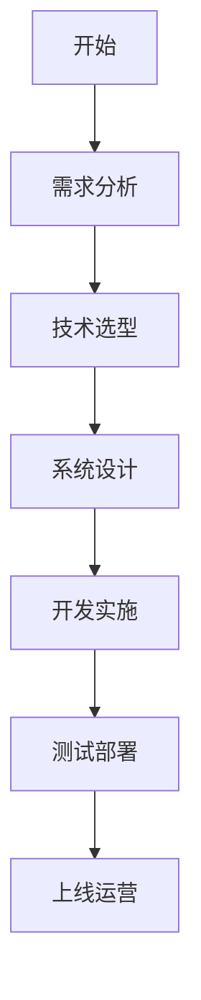
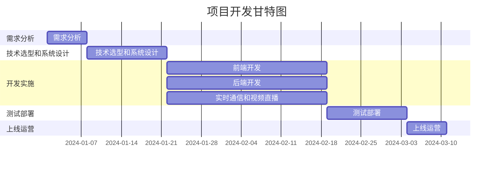

<div class="plan-header">

# 🚀 AI生成的开发计划

<div class="meta-info">

**⏰ 生成时间：** 2025-07-13 17:10:34  
**🤖 AI模型：** Qwen2.5-72B-Instruct  
**💡 基于用户创意智能分析生成**  
**🔗 Agent应用MCP服务增强**

</div>

</div>

---

### 在线教育平台开发计划

#### 1. 项目概述

**项目名称：** 在线教育平台

**项目背景：** 随着互联网技术的快速发展，线上教育逐渐成为主流。为了满足师生之间更加便捷、高效的互动需求，我们计划开发一个在线教育平台，支持视频直播、作业批改、学习进度跟踪和师生互动功能。

**目标用户：** 学生、教师、教育机构

**项目周期：** 6个月

#### 2. 技术方案

**技术栈：**
- **前端：** React.js, Redux, Webpack
- **后端：** Node.js, Express, MongoDB
- **实时通信：** WebSocket, Socket.io
- **视频直播：** WebRTC, AWS IVS
- **作业批改：** TensorFlow, PyTorch
- **部署：** Docker, Kubernetes, AWS

**架构图：**


#### 3. 开发计划


#### 🚀 第阶段：**


### 📋 1. **第1阶段：需求分析（1周）**

   - 与客户进行需求沟通
   - 撰写需求文档
   - 确定项目范围和目标


### 📋 2. **第2阶段：技术选型和系统设计（2周）**

   - 选择合适的技术栈
   - 设计系统架构
   - 编写详细的技术设计文档


### 📋 3. **第3阶段：开发实施（8周）**


#### 🚀 第3.1阶段：前端开发（4周）**

     - 开发用户界面
     - 实现前端功能

#### 🚀 第3.2阶段：后端开发（4周）**

     - 开发后端接口
     - 实现后端逻辑

#### 🚀 第3.3阶段：实时通信和视频直播（4周）**

     - 实现实时通信功能
     - 集成视频直播功能


### 📋 4. **第4阶段：测试部署（2周）**

   - 单元测试
   - 集成测试
   - 性能测试
   - 部署到测试环境
   - 用户验收测试


### 📋 5. **第5阶段：上线运营（1周）**

   - 部署到生产环境
   - 监控系统运行
   - 收集用户反馈

**甘特图：**


#### 4. 部署方案

- **容器化：** 使用Docker容器化应用，确保开发、测试和生产环境的一致性。
- **自动化部署：** 使用Kubernetes进行自动化部署和管理。
- **云服务：** 使用AWS提供云服务，包括计算资源、存储和数据库。

#### 5. 推广策略

- **内容营销：** 通过博客、社交媒体和在线课程介绍平台的特性和优势。
- **合作伙伴：** 与教育机构和知名教师合作，推广平台。
- **用户培训：** 提供详细的用户指南和培训课程，帮助用户快速上手。
- **用户反馈：** 收集用户反馈，持续改进产品。

##

---


<div class="prompts-highlight">

# 🤖 AI编程助手提示词

> 💡 **使用说明**：以下提示词基于您的项目需求定制生成，可直接复制到 Claude Code、GitHub Copilot、ChatGPT 等AI编程工具中使用


#### 1. 视频直播功能开发提示词


<div class="prompt-code-block">

```prompt
请为在线教育平台开发视频直播功能。

项目背景：
在线教育平台需要支持实时视频直播，以便教师可以进行在线授课。直播功能需要支持多用户同时观看、实时互动和录像回放。

功能要求：
1. 实现教师端的视频直播功能，包括视频流的推流和管理。
2. 实现学生端的视频观看功能，包括视频流的拉流和播放。
3. 支持实时互动功能，包括聊天、提问和回答。
4. 支持录像回放功能，学生可以观看历史课程录像。

技术约束：
- 使用WebRTC实现实时视频通信
- 使用AWS IVS进行视频流的管理和分发
- 前端使用React.js，后端使用Node.js和Express

输出要求：
- 完整可运行代码
- 详细注释说明
- 错误处理机制
- 测试用例
```

<div class="prompt-copy-section">
<button class="individual-copy-btn" data-prompt-id="0" data-prompt-content="请为在线教育平台开发视频直播功能。\n\n项目背景：\n在线教育平台需要支持实时视频直播，以便教师可以进行在线授课。直播功能需要支持多用户同时观看、实时互动和录像回放。\n\n功能要求：\n1. 实现教师端的视频直播功能，包括视频流的推流和管理。\n2. 实现学生端的视频观看功能，包括视频流的拉流和播放。\n3. 支持实时互动功能，包括聊天、提问和回答。\n4. 支持录像回放功能，学生可以观看历史课程录像。\n\n技术约束：\n- 使用WebRTC实现实时视频通信\n- 使用AWS IVS进行视频流的管理和分发\n- 前端使用React.js，后端使用Node.js和Express\n\n输出要求：\n- 完整可运行代码\n- 详细注释说明\n- 错误处理机制\n- 测试用例">
    📋 复制此提示词
</button>
<span class="copy-success-msg" id="copy-success-0" style="display: none; color: #28a745; margin-left: 10px;">✅ 已复制!</span>
</div>

</div>

</div>


#### 2. 作业批改功能开发提示词


<div class="prompt-code-block">

```prompt
请为在线教育平台开发作业批改功能。

项目背景：
在线教育平台需要支持自动和手动作业批改功能，以便教师可以高效地管理学生作业。作业批改功能需要支持多种题型，包括选择题、填空题和主观题。

功能要求：
1. 实现自动批改功能，支持选择题和填空题的自动评分。
2. 实现手动批改功能，支持主观题的教师手动评分。
3. 提供作业提交和批改记录，学生可以查看作业成绩和批改详情。
4. 支持批量导入和导出作业数据。

技术约束：
- 使用TensorFlow和PyTorch实现自动批改的机器学习模型
- 前端使用React.js，后端使用Node.js和Express
- 数据库使用MongoDB

输出要求：
- 完整可运行代码
- 详细注释说明
- 错误处理机制
- 测试用例
```

<div class="prompt-copy-section">
<button class="individual-copy-btn" data-prompt-id="0" data-prompt-content="请为在线教育平台开发作业批改功能。\n\n项目背景：\n在线教育平台需要支持自动和手动作业批改功能，以便教师可以高效地管理学生作业。作业批改功能需要支持多种题型，包括选择题、填空题和主观题。\n\n功能要求：\n1. 实现自动批改功能，支持选择题和填空题的自动评分。\n2. 实现手动批改功能，支持主观题的教师手动评分。\n3. 提供作业提交和批改记录，学生可以查看作业成绩和批改详情。\n4. 支持批量导入和导出作业数据。\n\n技术约束：\n- 使用TensorFlow和PyTorch实现自动批改的机器学习模型\n- 前端使用React.js，后端使用Node.js和Express\n- 数据库使用MongoDB\n\n输出要求：\n- 完整可运行代码\n- 详细注释说明\n- 错误处理机制\n- 测试用例">
    📋 复制此提示词
</button>
<span class="copy-success-msg" id="copy-success-0" style="display: none; color: #28a745; margin-left: 10px;">✅ 已复制!</span>
</div>

</div>

</div>


#### 3. 学习进度跟踪功能开发提示词


<div class="prompt-code-block">

```prompt
请为在线教育平台开发学习进度跟踪功能。

项目背景：
在线教育平台需要支持学习进度跟踪功能，以便教师和学生可以实时了解学习进度和成绩。学习进度跟踪功能需要支持课程进度、作业完成情况和考试成绩的记录和展示。

功能要求：
1. 实现学生学习进度的记录功能，包括课程进度、作业完成情况和考试成绩。
2. 提供教师端的进度管理功能，教师可以查看和管理学生的学习进度。
3. 支持学习进度的可视化展示，包括图表和报表。
4. 支持学习进度的导出功能，教师和学生可以导出学习进度报告。

技术约束：
- 前端使用React.js，后端使用Node.js和Express
- 数据库使用MongoDB
- 使用D3.js进行数据可视化

输出要求：
- 完整可运行代码
- 详细注释说明
- 错误处理机制
- 测试用例
```

<div class="prompt-copy-section">
<button class="individual-copy-btn" data-prompt-id="0" data-prompt-content="请为在线教育平台开发学习进度跟踪功能。\n\n项目背景：\n在线教育平台需要支持学习进度跟踪功能，以便教师和学生可以实时了解学习进度和成绩。学习进度跟踪功能需要支持课程进度、作业完成情况和考试成绩的记录和展示。\n\n功能要求：\n1. 实现学生学习进度的记录功能，包括课程进度、作业完成情况和考试成绩。\n2. 提供教师端的进度管理功能，教师可以查看和管理学生的学习进度。\n3. 支持学习进度的可视化展示，包括图表和报表。\n4. 支持学习进度的导出功能，教师和学生可以导出学习进度报告。\n\n技术约束：\n- 前端使用React.js，后端使用Node.js和Express\n- 数据库使用MongoDB\n- 使用D3.js进行数据可视化\n\n输出要求：\n- 完整可运行代码\n- 详细注释说明\n- 错误处理机制\n- 测试用例">
    📋 复制此提示词
</button>
<span class="copy-success-msg" id="copy-success-0" style="display: none; color: #28a745; margin-left: 10px;">✅ 已复制!</span>
</div>

</div>

</div>


#### 4. 师生互动功能开发提示词


<div class="prompt-code-block">

```prompt
请为在线教育平台开发师生互动功能。

项目背景：
在线教育平台需要支持师生互动功能，以便教师和学生可以进行实时沟通和交流。师生互动功能需要支持多种沟通方式，包括聊天、讨论和问答。

功能要求：
1. 实现师生之间的实时聊天功能，支持文本、图片和文件的发送。
2. 实现讨论区功能，支持师生之间的讨论和交流。
3. 实现问答功能，支持学生提问和教师回答。
4. 提供互动记录的管理功能，教师可以查看和管理互动记录。

技术约束：
- 使用WebSocket和Socket.io实现实时通信
- 前端使用React.js，后端使用Node.js和Express
- 数据库使用MongoDB

输出要求：
- 完整可运行代码
- 详细注释说明
- 错误处理机制
- 测试用例
```

<div class="prompt-copy-section">
<button class="individual-copy-btn" data-prompt-id="0" data-prompt-content="请为在线教育平台开发师生互动功能。\n\n项目背景：\n在线教育平台需要支持师生互动功能，以便教师和学生可以进行实时沟通和交流。师生互动功能需要支持多种沟通方式，包括聊天、讨论和问答。\n\n功能要求：\n1. 实现师生之间的实时聊天功能，支持文本、图片和文件的发送。\n2. 实现讨论区功能，支持师生之间的讨论和交流。\n3. 实现问答功能，支持学生提问和教师回答。\n4. 提供互动记录的管理功能，教师可以查看和管理互动记录。\n\n技术约束：\n- 使用WebSocket和Socket.io实现实时通信\n- 前端使用React.js，后端使用Node.js和Express\n- 数据库使用MongoDB\n\n输出要求：\n- 完整可运行代码\n- 详细注释说明\n- 错误处理机制\n- 测试用例">
    📋 复制此提示词
</button>
<span class="copy-success-msg" id="copy-success-0" style="display: none; color: #28a745; margin-left: 10px;">✅ 已复制!</span>
</div>

</div>

</div>


### 技术栈对比表格

| 技术 | 优点 | 缺点 | 适用场景 |
|------|------|------|----------|
| React.js | 高效的组件化开发，良好的社区支持 | 学习曲线较陡 | 前端开发 |
| Node.js | 高性能的服务器端开发，丰富的生态系统 | 回调地狱问题 | 后端开发 |
| MongoDB | 灵活的文档存储，支持高并发 | 查询性能不如关系型数据库 | 数据存储 |
| WebRTC | 实时通信，低延迟 | 需要处理不同浏览器的兼容性 | 实时通信 |
| AWS IVS | 高可用的视频流管理和分发 | 成本较高 | 视频直播 |
| TensorFlow | 强大的机器学习库，支持多种算法 | 需要较高的计算资源 | 作业批改 |
| PyTorch | 灵活的动态图机制，易用性强 | 社区支持不如TensorFlow成熟 | 作业批改 |
| WebSocket | 实时双向通信，低延迟 | 需要处理连接的稳定性和安全性 | 实时通信 |
| Socket.io | 简化WebSocket的使用，支持多种传输方式 | 依赖于WebSocket，可能增加复杂性 | 实时通信 |
| D3.js | 强大的数据可视化库，支持多种图表 | 学习曲线较陡 | 数据可视化 |
| Docker | 容器化应用，确保环境一致性 | 需要管理容器的生命周期 | 容器化 |
| Kubernetes | 自动化部署和管理容器 | 学习曲线较陡，配置复杂 | 容器管理 |

### 项目里程碑时间表

| 里程碑 | 时间 | 描述 |
|--------|------|------|
| 需求分析完成 | 2024-01-08 | 完成需求文档，确定项目范围 |
| 技术选型和系统设计完成 | 2024-01-22 | 完成技术选型，编写详细设计文档 |
| 前端开发完成 | 2024-02-19 | 完成前端用户界面和功能开发 |
| 后端开发完成 | 2024-02-19 | 完成后端接口和逻辑开发 |
| 实时通信和视频直播功能完成 | 2024-02-19 | 完成实时通信和视频直播功能开发 |
| 测试部署完成 | 2024-03-06 | 完成所有测试，部署到测试环境 |
| 上线运营 | 2024-03-13 | 部署到生产环境，监控系统运行 |

以上是在线教育平台的详细开发计划和AI编程助手提示词，希望对项目开发有所帮助。

</div>

