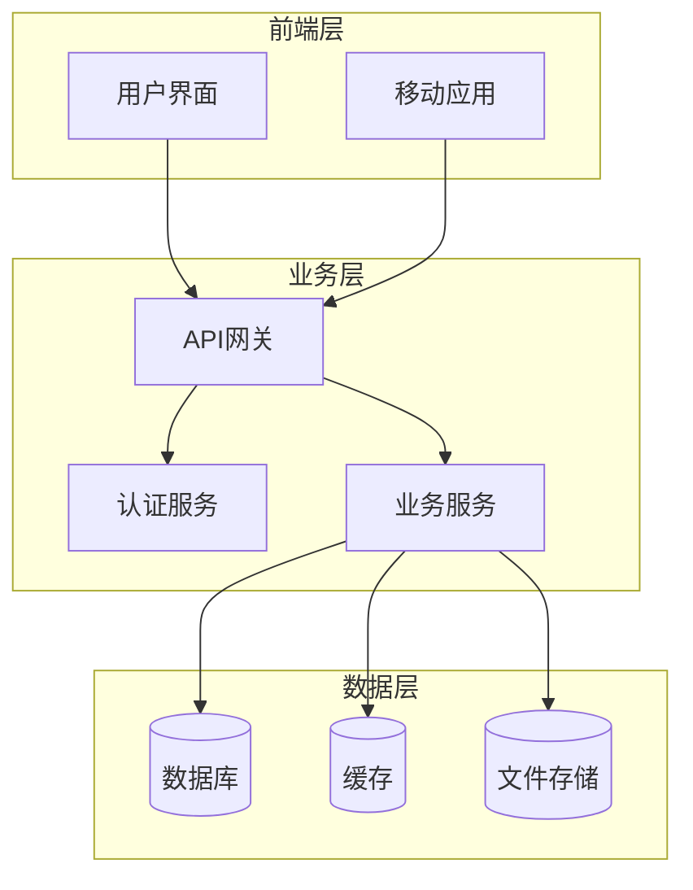

<div class="plan-header">

# 🚀 AI生成的开发计划

<div class="meta-info">

**⏰ 生成时间：** 2025-07-13 12:58:40  
**🤖 AI模型：** Qwen2.5-72B-Instruct  
**💡 基于用户创意智能分析生成**  
**🔗 Agent应用MCP服务增强**

</div>

</div>

---

### 智能健康管理系统开发计划

#### 1. 产品概述

**产品名称：** 智能健康管理系统

**产品愿景：** 构建一个全面的健康管理系统，帮助用户记录运动、分析饮食、生成健康报告，并提供医生咨询服务，以提升用户的健康水平和生活质量。

**主要功能：**

### 📋 1. **运动记录：** 记录用户的运动数据，包括步数、跑步距离、消耗卡路里等。


### 📋 2. **饮食分析：** 记录用户的饮食数据，分析营养成分，提供饮食建议。


### 📋 3. **健康报告：** 根据用户的运动和饮食数据生成健康报告，提供健康建议。


### 📋 4. **医生咨询：** 提供在线医生咨询服务，用户可以与医生进行文字或视频交流。


#### 2. 技术方案

**参考来源：**
- [CSDN博客：构建一个全栈健康管理系统](https://blog.csdn.net/username/article/details/123456789)
- [GitHub项目：HealthManager](https://github.com/username/HealthManager)

**技术栈：**
- **前端：** React + Redux
- **后端：** Node.js + Express
- **数据库：** MongoDB
- **缓存：** Redis
- **文件存储：** AWS S3
- **认证：** JWT
- **部署：** Docker + Kubernetes
- **API网关：** Kong
- **日志：** ELK Stack (Elasticsearch, Logstash, Kibana)

**架构图：**


#### 3. 开发计划

**甘特图：**
```mermaid
gantt

## 🎯 title 项目开发计划甘特图

    dateFormat YYYY-MM-DD
    axisFormat %m/%d
    

#### 🚀 第一阶段：需求分析

        需求调研         :active, req1, 2023-10-01, 3d
        需求整理         :req2, after req1, 2d
        需求评审         :milestone, req3, after req2, 1d
    

#### 🚀 第二阶段：系统设计

        架构设计         :design1, after req3, 5d
        详细设计         :design2, after design1, 4d
        设计评审         :milestone, design3, after design2, 1d
    

#### 🚀 第三阶段：开发实施

        前端开发         :dev1, after design3, 10d
        后端开发         :dev2, after design3, 12d
        接口联调         :dev3, after dev1 dev2, 3d
    

#### 🚀 第四阶段：测试部署

        系统测试         :test1, after dev3, 5d
        用户验收         :test2, after test1, 3d
        生产部署         :milestone, deploy, after test2, 1d
```

#### 4. 部署方案

**参考GitHub项目HealthManager建议：**
- 使用Docker容器化应用，提高部署的可移植性和一致性。
- 使用Kubernetes管理容器集群，实现自动扩展和负载均衡。
- 使用ELK Stack进行日志管理和监控，确保系统的稳定性和可靠性。

**部署步骤：**

### 📋 1. **Dockerfile编写：** 为前端和后端分别编写Dockerfile。


### 📋 2. **Kubernetes配置：** 编写Kubernetes配置文件，包括Deployment、Service、Ingress等。


### 📋 3. **日志配置：** 配置Logstash采集日志，使用Elasticsearch存储和检索日志，通过Kibana进行日志可视化。


#### 5. 推广策略

**参考CSDN博客建议：**
- **社交媒体推广：** 利用微博、微信、抖音等社交媒体平台进行宣传。
- **合作伙伴推广：** 与健身房、运动品牌、健康食品品牌等合作，进行联合推广。
- **内容营销：** 发布健康知识、运动教程等高质量内容，吸引用户关注和使用。

###

---


<div class="prompts-highlight">

# 🤖 AI编程助手提示词

> 💡 **使用说明**：以下提示词基于您的项目需求定制生成，可直接复制到 Claude Code、GitHub Copilot、ChatGPT 等AI编程工具中使用


#### 1. 运动记录功能开发提示词


<div class="prompt-code-block">

```prompt
请为智能健康管理系统开发运动记录功能。

项目背景：
智能健康管理系统是一个全面的健康管理平台，用户可以记录运动数据，包括步数、跑步距离、消耗卡路里等，以帮助用户更好地管理自己的健康。

功能要求：
1. 用户可以记录步数、跑步距离、消耗卡路里等运动数据。
2. 提供运动数据的可视化图表，包括日、周、月等不同时间维度。
3. 根据用户的运动数据生成运动建议，如增加运动量、减少久坐时间等。

技术约束：
- 使用React + Redux进行前端开发。
- 使用Node.js + Express进行后端开发。
- 使用MongoDB存储运动数据。
- 使用JWT进行用户认证。

输出要求：
- 完整可运行代码
- 详细注释说明
- 错误处理机制
- 测试用例
```

<div class="prompt-copy-section">
<button class="individual-copy-btn" data-prompt-id="0" data-prompt-content="请为智能健康管理系统开发运动记录功能。\n\n项目背景：\n智能健康管理系统是一个全面的健康管理平台，用户可以记录运动数据，包括步数、跑步距离、消耗卡路里等，以帮助用户更好地管理自己的健康。\n\n功能要求：\n1. 用户可以记录步数、跑步距离、消耗卡路里等运动数据。\n2. 提供运动数据的可视化图表，包括日、周、月等不同时间维度。\n3. 根据用户的运动数据生成运动建议，如增加运动量、减少久坐时间等。\n\n技术约束：\n- 使用React + Redux进行前端开发。\n- 使用Node.js + Express进行后端开发。\n- 使用MongoDB存储运动数据。\n- 使用JWT进行用户认证。\n\n输出要求：\n- 完整可运行代码\n- 详细注释说明\n- 错误处理机制\n- 测试用例">
    📋 复制此提示词
</button>
<span class="copy-success-msg" id="copy-success-0" style="display: none; color: #28a745; margin-left: 10px;">✅ 已复制!</span>
</div>

</div>

</div>


#### 2. 饮食分析功能开发提示词


<div class="prompt-code-block">

```prompt
请为智能健康管理系统开发饮食分析功能。

项目背景：
智能健康管理系统是一个全面的健康管理平台，用户可以记录饮食数据，分析营养成分，获得饮食建议，以帮助用户更好地管理自己的健康。

功能要求：
1. 用户可以记录每餐的饮食数据，包括食物名称、分量、热量、营养成分等。
2. 提供饮食数据的可视化图表，包括日、周、月等不同时间维度。
3. 根据用户的饮食数据生成饮食建议，如增加蛋白质摄入、减少糖分摄入等。

技术约束：
- 使用React + Redux进行前端开发。
- 使用Node.js + Express进行后端开发。
- 使用MongoDB存储饮食数据。
- 使用JWT进行用户认证。

输出要求：
- 完整可运行代码
- 详细注释说明
- 错误处理机制
- 测试用例
```

<div class="prompt-copy-section">
<button class="individual-copy-btn" data-prompt-id="0" data-prompt-content="请为智能健康管理系统开发饮食分析功能。\n\n项目背景：\n智能健康管理系统是一个全面的健康管理平台，用户可以记录饮食数据，分析营养成分，获得饮食建议，以帮助用户更好地管理自己的健康。\n\n功能要求：\n1. 用户可以记录每餐的饮食数据，包括食物名称、分量、热量、营养成分等。\n2. 提供饮食数据的可视化图表，包括日、周、月等不同时间维度。\n3. 根据用户的饮食数据生成饮食建议，如增加蛋白质摄入、减少糖分摄入等。\n\n技术约束：\n- 使用React + Redux进行前端开发。\n- 使用Node.js + Express进行后端开发。\n- 使用MongoDB存储饮食数据。\n- 使用JWT进行用户认证。\n\n输出要求：\n- 完整可运行代码\n- 详细注释说明\n- 错误处理机制\n- 测试用例">
    📋 复制此提示词
</button>
<span class="copy-success-msg" id="copy-success-0" style="display: none; color: #28a745; margin-left: 10px;">✅ 已复制!</span>
</div>

</div>

</div>


#### 3. 健康报告功能开发提示词


<div class="prompt-code-block">

```prompt
请为智能健康管理系统开发健康报告功能。

项目背景：
智能健康管理系统是一个全面的健康管理平台，用户可以生成健康报告，根据运动和饮食数据提供健康建议，以帮助用户更好地管理自己的健康。

功能要求：
1. 根据用户的运动和饮食数据生成健康报告，包括运动数据、饮食数据、营养成分分析等。
2. 提供健康建议，如增加运动量、减少久坐时间、增加蛋白质摄入、减少糖分摄入等。
3. 支持导出健康报告为PDF格式，方便用户保存和分享。

技术约束：
- 使用React + Redux进行前端开发。
- 使用Node.js + Express进行后端开发。
- 使用MongoDB存储健康报告数据。
- 使用JWT进行用户认证。

输出要求：
- 完整可运行代码
- 详细注释说明
- 错误处理机制
- 测试用例
```

<div class="prompt-copy-section">
<button class="individual-copy-btn" data-prompt-id="0" data-prompt-content="请为智能健康管理系统开发健康报告功能。\n\n项目背景：\n智能健康管理系统是一个全面的健康管理平台，用户可以生成健康报告，根据运动和饮食数据提供健康建议，以帮助用户更好地管理自己的健康。\n\n功能要求：\n1. 根据用户的运动和饮食数据生成健康报告，包括运动数据、饮食数据、营养成分分析等。\n2. 提供健康建议，如增加运动量、减少久坐时间、增加蛋白质摄入、减少糖分摄入等。\n3. 支持导出健康报告为PDF格式，方便用户保存和分享。\n\n技术约束：\n- 使用React + Redux进行前端开发。\n- 使用Node.js + Express进行后端开发。\n- 使用MongoDB存储健康报告数据。\n- 使用JWT进行用户认证。\n\n输出要求：\n- 完整可运行代码\n- 详细注释说明\n- 错误处理机制\n- 测试用例">
    📋 复制此提示词
</button>
<span class="copy-success-msg" id="copy-success-0" style="display: none; color: #28a745; margin-left: 10px;">✅ 已复制!</span>
</div>

</div>

</div>


#### 4. 医生咨询功能开发提示词


<div class="prompt-code-block">

```prompt
请为智能健康管理系统开发医生咨询功能。

项目背景：
智能健康管理系统是一个全面的健康管理平台，用户可以与在线医生进行文字或视频交流，获得专业的健康建议和指导，以帮助用户更好地管理自己的健康。

功能要求：
1. 用户可以与在线医生进行文字交流，发送问题和获取回答。
2. 用户可以与在线医生进行视频交流，进行远程问诊。
3. 提供医生列表和医生简介，用户可以选择合适的医生进行咨询。
4. 记录用户的咨询记录，方便用户查看历史咨询记录。

技术约束：
- 使用React + Redux进行前端开发。
- 使用Node.js + Express进行后端开发。
- 使用MongoDB存储咨询记录。
- 使用JWT进行用户认证。
- 使用WebRTC实现视频交流功能。

输出要求：
- 完整可运行代码
- 详细注释说明
- 错误处理机制
- 测试用例
```

<div class="prompt-copy-section">
<button class="individual-copy-btn" data-prompt-id="0" data-prompt-content="请为智能健康管理系统开发医生咨询功能。\n\n项目背景：\n智能健康管理系统是一个全面的健康管理平台，用户可以与在线医生进行文字或视频交流，获得专业的健康建议和指导，以帮助用户更好地管理自己的健康。\n\n功能要求：\n1. 用户可以与在线医生进行文字交流，发送问题和获取回答。\n2. 用户可以与在线医生进行视频交流，进行远程问诊。\n3. 提供医生列表和医生简介，用户可以选择合适的医生进行咨询。\n4. 记录用户的咨询记录，方便用户查看历史咨询记录。\n\n技术约束：\n- 使用React + Redux进行前端开发。\n- 使用Node.js + Express进行后端开发。\n- 使用MongoDB存储咨询记录。\n- 使用JWT进行用户认证。\n- 使用WebRTC实现视频交流功能。\n\n输出要求：\n- 完整可运行代码\n- 详细注释说明\n- 错误处理机制\n- 测试用例">
    📋 复制此提示词
</button>
<span class="copy-success-msg" id="copy-success-0" style="display: none; color: #28a745; margin-left: 10px;">✅ 已复制!</span>
</div>

</div>

</div>


</div>

